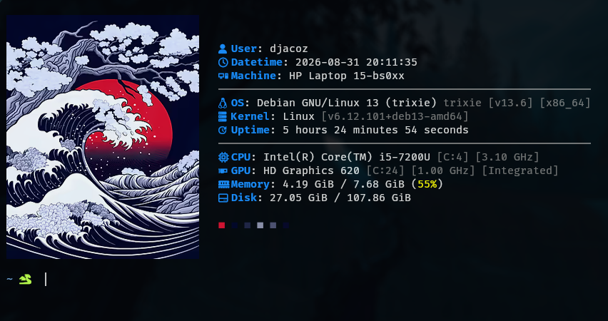
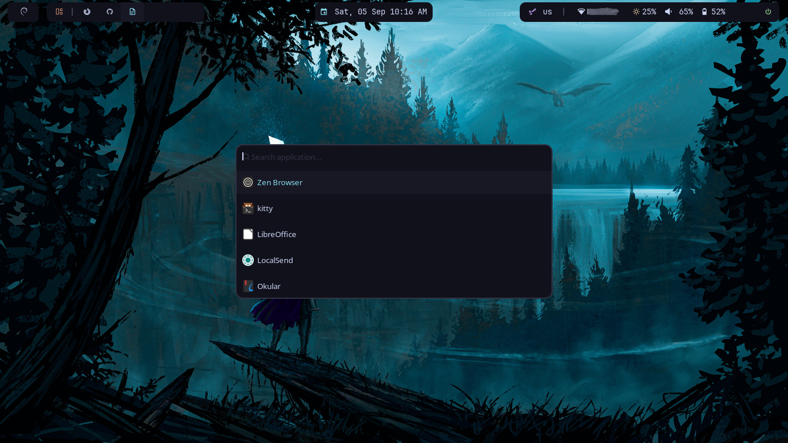

# Jacob's dotfiles

My personal workflow configuration and customization for **Debian GNU/Linux**. This configuration is carefully chosen for extreme minimalism and to maximize my laptop's performance.

  
<b>Screenshots</b>

  
  

## Contents

### System and window management
- i3 + picom configuration
- betterlockscreen configuration
- dunst configuration
- polybar + rofi configuration

### Terminal and shell environment
- Kitty configuration
- Fish configuration
- Starship prompt configuration

### File management and exploration
- Superfile configuration

### Code development and version control
- Neovim configuration
- Micro configuration
- Git configuration

